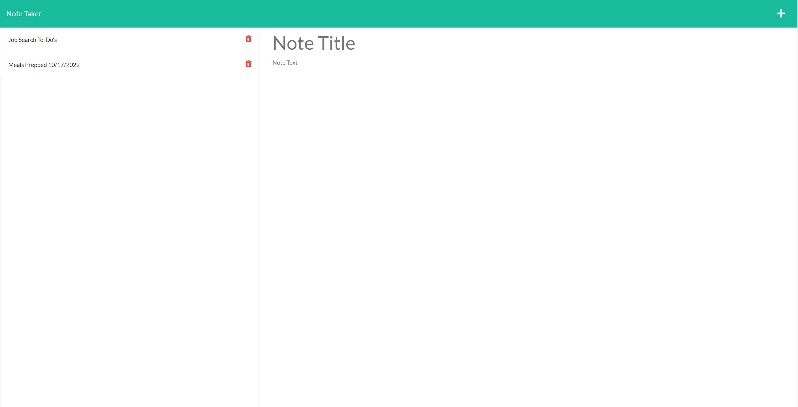

# Toacin's Note Taker

## Table of Contents
* [Description](#Description)
* [Technologies](#Technologies)
* [Screenshot](#Screenshot)
* [Installation](#Installation)
* [Usage](#Usage)
* [License](#License)
* [Questions](#Questions)

## Description

This full-stack application is a personal note-taker that allows me to take notes and save them for later reference. Specifically, on application load, I can view previous notes, write a new note, and delete previous notes. Because it is a deployed server application on Heroku, I am able to use this application on the go on any device.

## Technologies

The main technology at play here (in my contribution) is express, which is used to create an instance of a server. Alongside this, node.js and many of its modules, namely filesystem and path, are used to handle execution of code in the server and interaction with my mock database.

## Screenshot

---

## Installation

No installation needed for deployed application. Visit link above.  
If you wish to clone this repo see below:
Installation instructions: On github, clone repo and run `npm i` in Windows Command Processor/Terminal to install dependencies, and then see Usage below.

## Usage

In Windows Command Processor/Terminal, run `node server.js`, and visit localhost:3001

## License

No license

---

## Questions

If you have any follow up questions, feel free to reach out at toacinp@gmail.com  
GitHub: https://www.github.com/Toacin